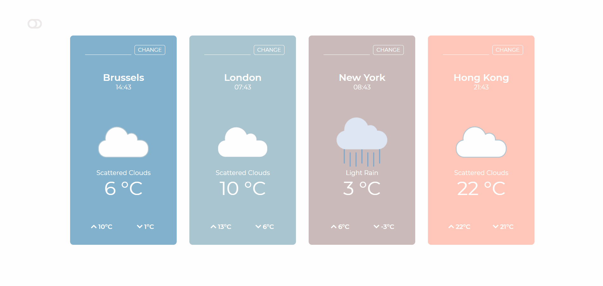

# Weather App in React

An application fetching information from  [Weatherbit.io](https://www.weatherbit.io/) API to show the weather information with 5-day forecasts. 4 default cities are shown on the landing page for a quick gaze at the latest weather around the world. Users can also update the query according to their preferences.
Night mode is available for the application.

## [Visit the Live Page ](https://chevtong.github.io/react-weather-compare/)
 

 
 

---
### WIP 

1. catch error and add to display for no JSON response on wrong city names
2. Add more weather info on the details page
2. find out how to use styled-components efficiently for night mode
 
 

---

### Tools
- React
- [React-live-clock](github.com/pvoznyuk/react-live-clock')
- [Styled-components](https://styled-components.com/)

- [Weatherbit.io API](https://www.weatherbit.io/)

- [Flaticon for weather icons](https://www.flaticon.com/)

- [Font Awesome for buttons](https://fontawesome.com/)

- [Google Font](https://fonts.google.com/)

- VS Code
